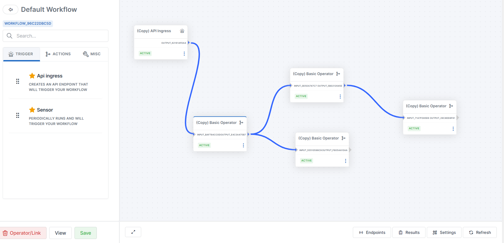
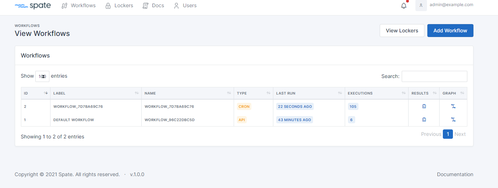
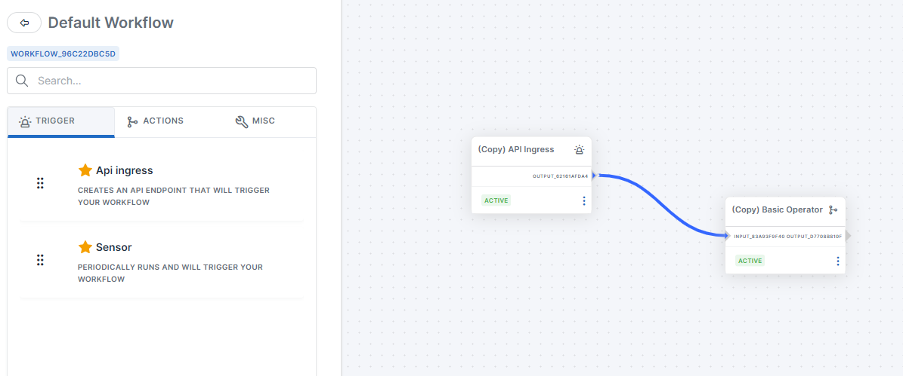
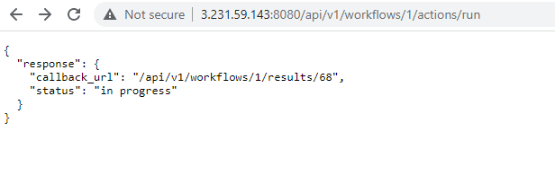
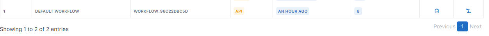
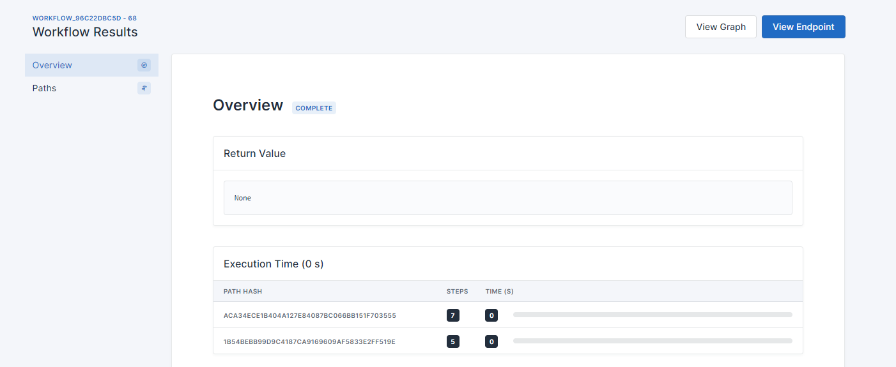
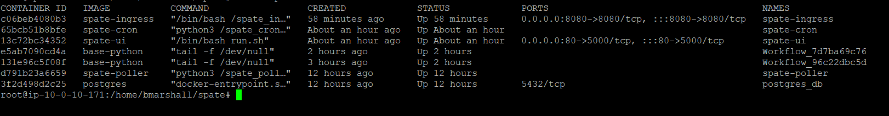
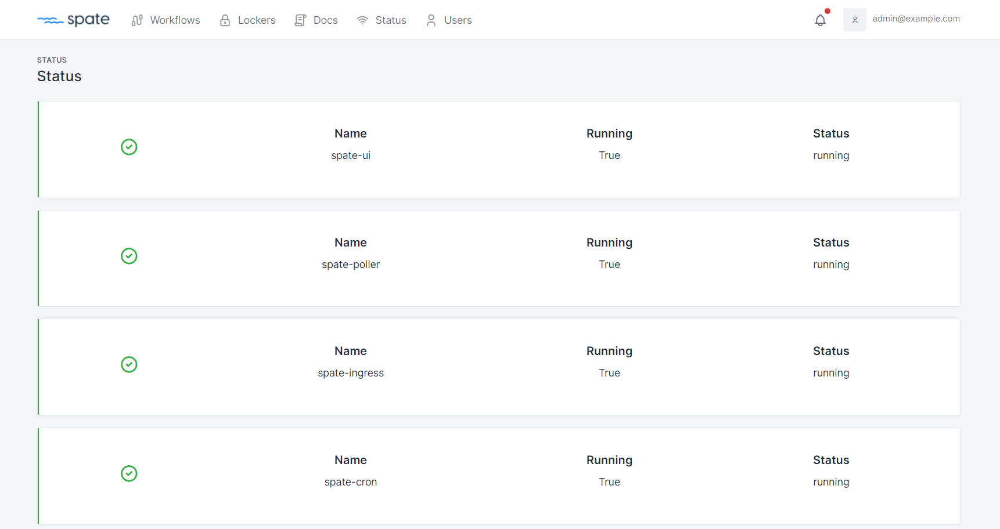

# Spate Documentation

Easily create and run Workflows          |  
:-------------------------:|
  |

### Table of Contents
1. [What is Spate?](#what-is-spate)
2. [Use Case](#use-case)
3. [How it Works](#how-it-works)
4. [Getting Started](#getting-started)
5. [Setting Up Your First Workflow](#setting-up-your-first-workflow)
6. [FAQ](#faq)
7. [Development](#development)
8. [Todo](#todo)

### What is Spate?

Spate is a workflow and automation platform that allows anyone to quickly automate technical/business processes. It was first developed for the Information Security space however it can be used for any vertical. While automation is not always the answer, teams can use this platform to become more efficient and spend their precious (manual) time on other tasks.

### Use Case
(BEFORE) Let's look at a typical workflow for Incident Response (IR) for domain enrichment.
+ An alert fires and says "www. bad domain.com" is potentially a C2 channel
+ You have 5 security tools with data (endpoint, firewall, network, AD, etc.) that may be helpful
+ If you are lucky, you have a engineering team that has spent thousands of hours mapping data between the tools (lol)
+ You must log into the tools and perform manual searching and then worry about reporting (huge hassle)

(AFTER) With Spate, you can automate this pretty quickly.
+ An alert fires and says "www. bad domain.com" is potentially a C2 channel
+ You run the Spate Workflow and Spate queries and filters the data from the security tools
+ On success, it uploads the data to a Google Sheet
+ When complete, it sends a email to a mailing list with the report link

### How it Works

Spate is built on Flask (e.g. python framework) and leverages containerization (docker) for executing workflows. A "Workflow" is just a set of blocks that contain your automation tree. Users can use the drag-and-drop UI to add and connect Operators (blocks of logic) to their Workflow. Each Workflow has its own docker container.

Spate currently supports "API" and "CRON" Triggers. A trigger is "how" the Workflow is executed. For example, if your Workflow contains the "API" trigger, then users can visit a API endpoint to start the Workflow. The "CRON" trigger executes every X minutes and runs your Workflow. These two triggers will support the majority of your Workflows. Coming soon is a "FORM" trigger (basically lets you build a UI based form for input).

Users can add Operators to your Workflow and also edit the code. Everything is in "python" code. So if you understand Python, you can easily update/edit/add new Operators for your business process. 

### Getting Started
+ Make sure docker is installed (ubuntu works fine)
+ Clone the repo
+ Build the images with: `cp tools/build_all.sh $PWD && bash build_all.sh && rm build_all.sh`
+ Create base image with: `cd docker_image && docker build -t base-python .`
+ Start the containers: `docker-compose up -d postgres_db && sleep 10 && docker-compose up -d spate_ui && docker-compose up -d spate_poller spate_cron spate_ingress`
+ Visit `https://your-ip`. Email is `admin@example.com` and password is `admin`
+ Check the [Health of your deployment](#service-status)
+ See the following "Setting Up Your First Workflow" section for your first Workflow

### Setting Up Your First Workflow

After the "Getting Started" section above, lets set up and execute a API based Workflow.

#### 1.) Select the "Graph" icon on "Default Workflow"

#### 2.) Drop the "API Ingress" and "Basic Operator" (under Actions) and connect them. After, hit the "Refresh" button at the bottom right (IMPORTANT)

#### 3.) Visit the API endpoint (port 8080) to start the Workflow

#### 4.) Go back to the Workflows page and select the "Results" icon

#### 5.) View the results of your Workflow

### FAQ

##### What are the different docker images?
There are 5 custom docker images and the 6th is a postgresql image (which may not be used if you are using something like RDS). 
+ spate-ui - This is the main UI portion (on port 443)
+ spate-ingress - This container (on port 8443) has a API endpoint for workflows that have a API trigger. You use this endpoint to execute your workflows.
+ spate-cron - This container (no listening ports) queries all the workflows with a Cron trigger and executes the workflow.
+ spate-poller - This container performs some background jobs such as removing unused images/containers
+ base-python - This image is used as the "base" image for the Workflows. Spate deploys your code into this container and executes it.

##### How does Spate execute code?
Each Workflow will have its own docker container. When you create a new Workflow, Spate starts a container with the Workflow name. When your workflow is executed (either through API or the Cron trigger) the code from the workflow is executed within the docker container. 

##### What are Operators and Links?
Operators are the small blocks you see in the workflow. They can contain code and are the building blocks of your workflow. Links just connect the operators together and can also contain code. If the code within the Operator or Link returns False (e.g. return False), the path in the workflow will stop execution. Any other value and the path will continue. Typically I recommend keeping the code within the Operator very specific and include logic within the Link code. For example, if you are a making a network request to a API endpoint, include that code within your Operator and processing the success/error within the Link. 

##### What are Triggers and Actions?
Triggers and Actions are a type of Operator. Triggers will initiate the workflow and Spate currently supports "API" and "Cron" triggers. If your workflow has a API trigger, Spate sets up a API endpoint and if you hit that endpoint (with curl or your browser for example), the workflow will execute. If your workflow has a Cron trigger, it will execute your workflow every X minutes (this is configurable). On the other hand, Actions are Operators that code building blocks. For example, you might create a Operator that "Adds a row to Google Sheets" and you can save it and reuse it elsewhere. 

##### What does the "refresh" button do on the Workflow graph?
The refresh button will take all of your code (on the Operators and Links in the Workflow) and deploy it (along with the neccesary imports/libraries) into a docker container so that it is ready for execution. When you update your Workflow, it does NOT automatically deploy the changes to the docker container. The refresh button pushes the changes to the container. This is why if you update your code in the Workflow and are not seeing different results, you need to hit the Refresh button.

##### I setup my workflow and executed it, but the return value is None... what do I do?
You need to setup `Path for Return Value`. This can be found by editing the Trigger Operator in your Workflow and under Settings, selecting the return path. Once selected, the specific path in your workflow will now be the return value. 

##### What are Lockers?
Lockers basically can hold key:value pairs that your workflow can leverage. For example, you can store env variables in the Locker or sensitive data such as API keys and/or passwords. Only workflows that have the locker added can access the data within.

##### How can I share data between workflow executions?
Let's pretend you have a workflow that has executed twice. How does the second execution access data from the first? Maybe you want to save or access data between executions? You can use the "Store" to do this. Within your workflow code, you can use `put_store("your_key","your_value")` to add data to the store and `my_value = get_store("your_key")` to access the data. This way, you can share data between executions. It is good to note that this is NOT a solution to share large amounts of data. I would say if you are storing more than 1MB of data, then use a external database. 

##### How do I know if my deployment is healthy?
I would say the best way is to check the "Status" page on the Spate-ui container. Log into the web UI (port 443) and navigate to the Status page in the header. If everything is healthy, you are good to go. If not, I would recommend re-reading the docs for getting started.

### Development

##### Stop docker images
`docker-compose down`

##### Create base image
`cd docker_image && docker build -t base-python .`

##### Build docker images
`cp tools/build_all.sh $PWD && bash build_all.sh && rm build_all.sh`

##### Authentication
`admin@example.com:admin`

##### Start docker images
`docker-compose up -d postgres_db && sleep 10 && docker-compose up -d spate_ui && docker-compose up -d spate_poller spate_cron spate_ingress`

##### Docker debugging
Your 'docker ps' command should look something like this (4 containers with spate_). Check the logs of the containers for errors.

##### Service status
You can check the status of the deployment by viewing the "Status" page

### TODO
- [ ] Add "Form" trigger
- [x] Improve admin controls in UI (e.g. what users can edit/view workflows)
- [ ] Improve documentation
- [ ] Add RBAC to the Lockers
